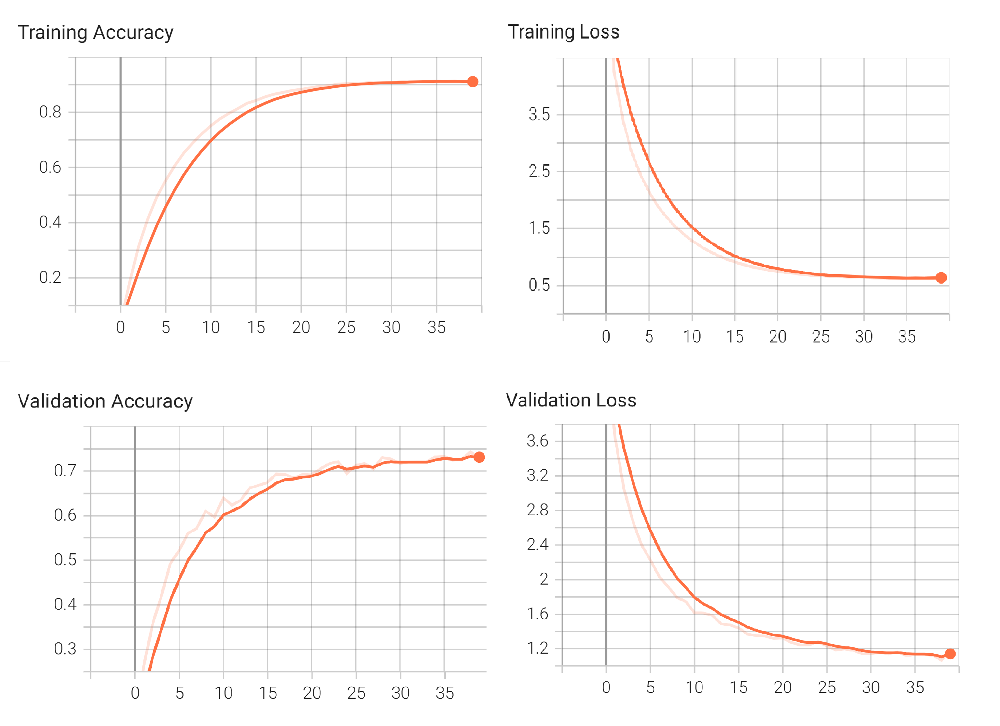
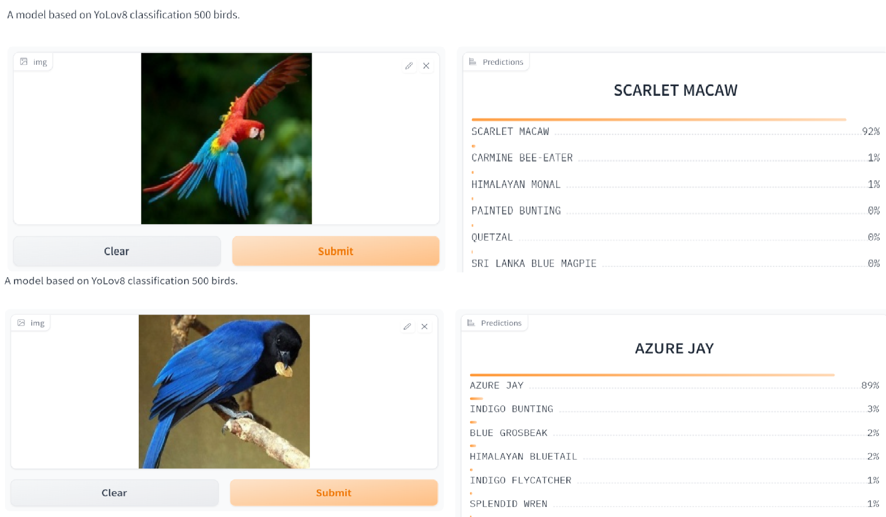

## Pytorch-Image-Classification

A model of **image classification** based on **Yolov8** architecture using pytorch. Here, i use a **custom dataset ** of **500 bird species** containing about ** 80,000 images** for training, validation and testing.

### Dependencies

* Python3
* Pytorch
* Tensorboard

```python
pip instal pytorch       # pytorch library
pip install torchsummary # summary
pip install torchvision  # pytorch for vision
```

**NB**: Update the libraries to their latest versions before training.

### How to run

⬇️⬇️**Download** and extract training dataset on Kaggle: [500 bird species dataset](https://www.kaggle.com/datasets/gpiosenka/100-bird-species)

⬇️⬇️**Download** pretrained model: [Model](https://drive.google.com/file/d/1zyREJei3KgIUaEEPvsaZxjdXNuD6grgx/view)

🤗🤗**Hugging face** version: [Hugging Face](https://huggingface.co/spaces/vvd2003/Yolov8_cls_500_bird_species)

Run the following **scripts** for training and/or testing

```python
python train.py # For training the model 
```

### Training results

|    | Accuracy | Size | Training Epochs | Training Mode |
|----|----|----|----|-----|
| **Model** | 74.37 | 415.2 MB  |  40 |  scratch |

**Batch size**: 64, **GPU**: RTX 3050 4G

### Training graphs

**Model:** 

Finetuning the model.


### Sample outputs

Sample classification results



### Evaluation

**Accuracy** of the network on the 2500 test images: **76.38%**

### Observations

1. The **MODEL** with 38M params has a very large size i.e **0.4 GB**, compared to other models like **Resnet18(40 MB)**
2. Adjusting parameters like **batch size, number of workers, pin_memory, ** etc. may help you **reduce training time**, especially if you have a big dataset and a high-end machine(hardware).
3. Adjusting parameters like **learning rate, weight decay** etc maybe can help you **improve** model.
### Todo

1. Experiments with different **learning-rate and optimizers**.
2. **Converting and optimizing** pytorch models for **mobile** deployment.

### Authors

Van Duc
 
### Acknowledgments
* "https://blog.roboflow.com/whats-new-in-yolov8/"
